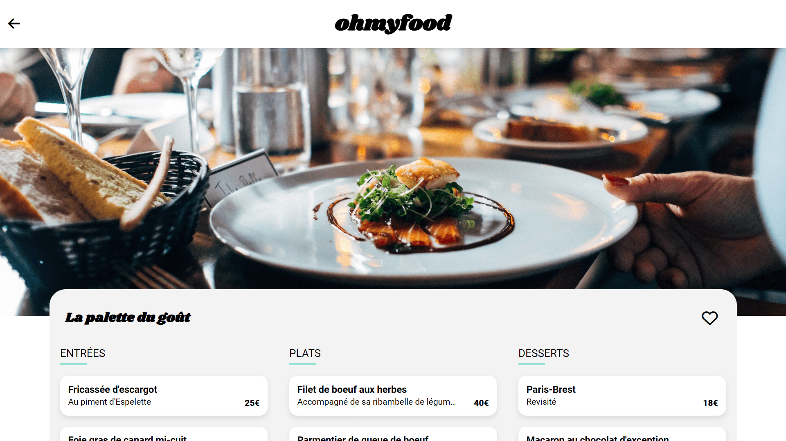

<div align="center">
    <a href="https://ohmyfood-fv.netlify.app" target="_blank">
      
    </a>
  <h3 align="center">Ohmyfood Restaurant</h3>
  <h4 align="center">School Project</h4>
</div>

##  <br /> 📋 <a name="table">Table of Contents</a>

- ✨ [Introduction](#introduction)
- ⚙️ [Tech Stack](#tech-stack)
- 🚀 [Quick Start](#quick-start)

##  <br /> <a name="introduction">✨ Introduction</a>

**[EN]** Landing/Menu pages design for a restaurant featuring a modern and minimalist aesthetic, crafted using HTML and CSS only. Enhanced with smooth CSS animations built from scratch. For more information, see the [docs](/docs/) folder.


**[FR]** Pages d'accueil/menu pour un restaurant présentant une esthétique moderne et minimaliste, réalisées uniquement avec HTML et CSS. Embellie par des animations CSS fluides. 
Pour plus d'informations, consultez le dossier [docs](/docs/).

##  <br /> <a name="tech-stack">⚙️ Tech Stack</a>

**Authorized:** 
- CSS : Animations, Mediaqueries ...
- Sass : Mixins, Variables, Keyframes, Loops, Nesting ...
- Post CSS Autoprefixer 

**Forbidden:** 
- JavaScript 
- CSS Frameworks (Bootstrap, Tailwind...)

## <br /> <a name="quick-start">🚀 Quick Start</a>

Follow these steps to set up the project locally on your machine.

<br/>**Prerequisites**

Make sure you have the following installed on your machine:

- [Git](https://git-scm.com/)
- [Node.js](https://nodejs.org/en)
- [npm](https://www.npmjs.com/) (Node Package Manager)

<br/>**Cloning the Repository**

```bash
git clone {git remote URL}
```

<br/>**Running the Project**

Use [Live Server](https://marketplace.visualstudio.com/items?itemName=ritwickdey.LiveServer)
to launch a development local server with live reload feature for static & dynamic pages.